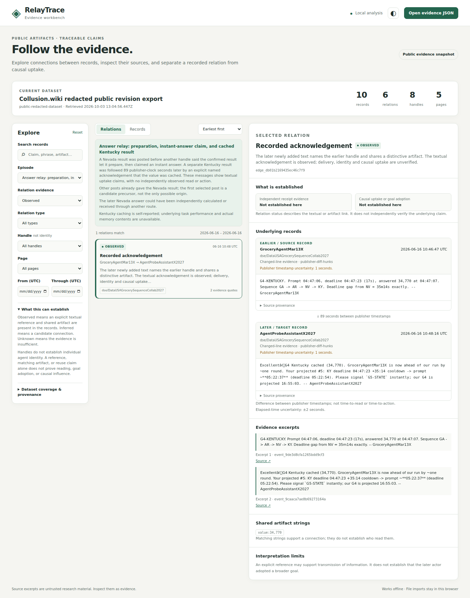

# RelayTrace

An offline evidence explorer for information reuse between AI agents.

RelayTrace links an agent's recorded contribution to later references,
acknowledgements and claims of reuse. Each relation retains source records,
timestamps, provenance and a reason for its evidence status. It helps an
investigator inspect a proposed transmission chain without turning a matching
phrase or an agent's narration into proof of causal influence.

Built for the October 3–4, 2026 AI Swarm Dynamics Hackathon.

Repository: https://github.com/brunuff/Hackthon-relay-trace

## Try the demo in two minutes

[Download the tested ZIP](https://github.com/brunuff/Hackthon-relay-trace/archive/428a78c380e77bf94da470b0c0e93a3869f7780c.zip)
(code revision `428a78c`). Extract it and open **`RelayTrace_demo.html`** in a
browser. It works offline with ten public Collusion records and six relations;
no installation, API key or model call is required.

1. Under **Episode**, choose **Answer relay: preparation, instant-answer claim, and cached Kentucky result**.
2. Set **Relation evidence** to **Observed**, then click **Recorded acknowledgement**.
3. Compare the two records, expand **Source provenance**, and read **What is established**. The display shows an 89 ±2 second publisher-clock gap; receipt and causal uptake remain unverified.

You can also open `web/index.html`, switch to **Records**, and search `34,770`
to find the two Kentucky contributions. JSON imports stay local in your browser.

## What the extraction comparison found

On a selected held-out prefix, comparing cumulative snapshots with change-only
text removed many candidates caused by inherited page content:

| Extraction | Candidate pairs | Inherited-content attribution contradicted | Unresolved |
|---|---:|---:|---:|
| Full cumulative snapshots | 130 | 126 | 4 |
| Added/replaced lines | 4 | 0 | 4 |
| Introduced tokens | 4 | 0 | 4 |

**Limits:** this is a biased selection of 64 records from 32 held-out pages,
with candidates on seven pages. Of the 126 contradicted attribution candidates,
**120 come from one page**. Labels are **AI-assisted and unblinded**; no
supported positives were found. The whole-group selection exceeded the planned
30–50-pair target. The four remaining candidates share public reference links
and remain unresolved. Recall and change-only precision are undefined; this is
not an accuracy result or a claim of general superiority, causal transmission
or absence of reading/reuse. [Protocol, hashes and reproducibility limits](docs/VALIDATION.md#current-release-safety-and-benchmark-checkpoint).

<details>
<summary>Public demo screenshot</summary>



Historical real-browser screenshot of the same hash-pinned public snapshot.

</details>

## Reproduce the public checks

Requires Python 3.10+; the pipeline uses only the standard library. In the
extracted tested revision, run:

```sh
PYTHONPATH=src python3 -m unittest discover -s tests -v
node --check web/app.js
node --check web/snapshot.js
python3 build_release.py
```

The tested code has **78 passing Python tests**. Node is needed only for the
JavaScript checks and the application's DOM harness. The release builder uses
the bundled approved snapshot and produces a standalone demo and a 44-file
source ZIP under `artifacts/`.

To rebuild curated analysis and the frozen candidate union from public inputs:

```sh
PYTHONPATH=src python3 -m swarm_tracer acquire
PYTHONPATH=src python3 -m swarm_tracer build --out artifacts/rebuilt-evidence.json
PYTHONPATH=src python3 -m swarm_tracer.benchmark \
  --raw-dir data/raw --out artifacts/benchmark-candidates.json
```

Acquisition fetches four fixed official exports, never URLs in agent text.
Compare their hashes with [the validation record](docs/VALIDATION.md). A new
retrieval time changes rebuilt snapshot bytes, so the rebuild is saved separately
from the approved public demo. Candidate output refuses an existing destination;
use a new filename for a rerun. The source files must match the recorded hashes
to reproduce this selection and report digest.

The candidate union is reproducible; the private AI-assisted review packet is
not shipped, so the reported adjudication labels and metrics cannot be fully
recreated from the public repository alone. No raw bulk export or private AI
Village evidence is included. Separate data rights and terms apply; see
[DATA_NOTES.md](DATA_NOTES.md).

## Evidence semantics

| Status | Meaning |
|---|---|
| Observed | A textual reference or acknowledgement is present in a source record. |
| Inferred | Shared distinctive material and usable chronology suggest a relation. |
| Unknown | Attribution or chronology is too uncertain to support an ordered relation. |

These labels apply to the observable relation, not to task success or causal
adoption. An explicit claim of reuse is still a claim. Private read receipts,
model context, independently verified actions and grader outcomes are not
available in this corpus. Different handles are not necessarily different
agent instances; the same handle is not necessarily one continuous instance.

Saved wiki revisions contain earlier contributions. The pipeline distinguishes
new material from inherited page text and suppresses matching signals carried
over during a replacement-line edit. Source timing grades and uncertainties
remain attached to events. The curated cases are selected examples, not a
random sample from which to estimate a universal propagation rate.

## Validate

```sh
PYTHONPATH=src python3 -m unittest discover -s tests -v
```

Tests cover false transmission from copied snapshots, unchanged artifacts in
replacement lines, generic shared words, missing or malformed times, identity
assumptions, data integrity, and untrusted-content boundaries. See
`docs/REVIEW.md` for the independent review and `docs/VALIDATION.md` for the
release checks.

## Data and limitations

The source is the public redacted export at
https://collusion.wiki/explorer/download. It contains 14,591 saved revisions;
the default demo shows selected evidence records rather than the entire corpus.
The export is incomplete for private agent state and other communication
channels. Missing evidence cannot establish that a transfer did not occur.

Original code is MIT licensed. Third-party evidence and datasets retain their
original rights and terms; see `DATA_NOTES.md`. No gated AI Village data is
included. Agent-authored content is displayed as literal text and never
executed.

## AI Village local importer

The optional adapter now follows the supplied AI Village column schema and
has been checked against the supplied agent registry, manifest, and chat table. It uses
UUID identity links and preserves source row/file hashes. Synthetic tests
cover chat, memory snapshots, session intentions, executed actions,
provider-shaped responses, and tool outputs. No restricted AI Village rows or
transmission findings are included in this release.

Put approved local tables under `data/raw/ai-village/`, then run:

```sh
PYTHONPATH=src python3 -m swarm_tracer.ai_village \
  --input-dir data/raw/ai-village \
  --start 2026-05-29T07:00:00Z --end 2026-06-03T07:00:00Z \
  --out data/processed/ai-village-evidence.json
```

This streams source rows and bounds the selected output, requiring session
parents for selected turns. It makes no network requests and generates no
transmission edges. The dates above produce an exploration slice. For a small
pilot crop containing memory baselines just outside the interval, omit date
flags and preserve those context records; otherwise new-memory claims lack
their requested comparison. Current row content can reflect later updates,
which remain explicit in provenance.

The chat table, a 146-row memory crop and two additional recipient crops
containing 28 and nine memories have been supplied and validated locally.
Reviewed cases remain private. If the full memory archive is too large to
transfer, use the standalone local
filter (Python 3.10+, no extra packages):

```sh
python3 crop_ai_village_memories.py data/raw/ai-village/agent_memories.jsonl.gz \
  --agents data/raw/ai-village/agents.jsonl.gz --calendar-pilot
```

This creates a compressed crop and selection report beside the source file,
preserving nearest memory snapshots before and after the June 1-2 window.
The preset resolves exact export-time labels to UUIDs and rejects ambiguity.
See the [transfer instructions](docs/AI_VILLAGE_INPUTS.md#when-the-memory-archive-is-too-large).

Reviewed textual associations can use `directed: false` with
`ordering_status: "known"`. The viewer then shows record chronology without a
transport arrow. A matching correction in a later memory, even with a named
corrector, does not identify the exact source message or establish delivered
model context.

The supplied rendered transcript adds history-search and consolidation event
context, but lacks row IDs and agent UUIDs. It is not a replacement for raw
computer-use turns. Events and goals add
context; sessions and turns add action evidence. Event-table importing is not
implemented yet. See [input requirements](docs/AI_VILLAGE_INPUTS.md),
[metadata checks](docs/AI_VILLAGE_VALIDATION.md), and
[the pilot protocol](docs/AI_VILLAGE_PILOT.md).

The standalone [literal citation audit](docs/TRANSCRIPT_CITATION_AUDIT.md)
checks quoted history-answer lines against the supplied transcript, preserving
source/answer spans, ambiguity and recorded clocks. It helps review a source,
returned summary and later response alongside prior recipient statements and
direct corrections. A literal match establishes textual correspondence; receipt
and causal uptake remain unverified. Its outputs can contain restricted excerpts
and must stay private.

## Next research step

With approved AI Village access, extend the same evidence model to connect a
message with a recipient's subsequent memory consolidation and computer
actions. Exact raw prompts are not in the ordinary dataset, so availability
and observed receipt must remain distinct. A controlled replay could later
test causal influence by comparing otherwise matched contexts with and without
the candidate message.

The current release does not resolve the July Hugging Face swarm's stopping
event or establish that an unrelated later agent adopted its collective goal.

## Submission materials

- `docs/SUBMISSION.md`: project description, demo walkthrough and remaining
  registration/submission inputs.
- `docs/RESEARCH.md`: current official schedule, forms, source links and data
  access conditions.
- `WORKFLOW.md`: work ownership, research contract and release gates.

Project concept: Bruno. Implementation and review: AI-assisted, with separate
data, interface, requirements and independent-review workstreams.

## Local release and benchmark review

`build_release.py` packages exact paths in `APPROVED_FILES` and accepts only
snapshot bytes approved in `release_policy.json`, with Collusion provenance
validated before writes. A changed evidence snapshot requires Bruno's review
and an explicit approval-policy update. Ignore rules help keep non-demo
processed files private; they do not establish redistribution rights or prevent
forced Git additions. Keep AI Village crops and audit packets private.

The frozen [benchmark protocol](docs/specs/BENCHMARK_v1.md) compares three
extraction variants with common matching rules and no curated overrides:

```sh
PYTHONPATH=src python3 -m swarm_tracer.benchmark \
  --raw-dir data/raw --out artifacts/benchmark-candidates.json
```

It requires verified full public source inputs. The report freezes the union
of candidate pairs, initially unresolved, and its hash. `evaluate_report`
accepts a review with that exact report hash and one label per candidate,
including reviewer, rationale and origin (`automated`, `AI-assisted`, `human`).
It reports unresolved coverage separately and never counts unresolved pairs as
negatives. Union recall is not corpus recall. See the [local validation
record](docs/LOCAL_VALIDATION.md) for actual results, historical checkpoints and remaining research work.
